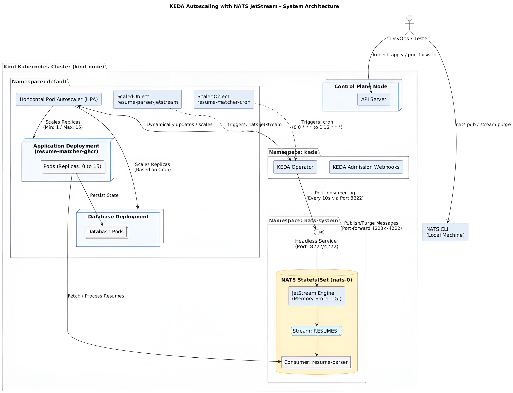

## KEDA Autoscaling with NATS JetStream
Event‑driven Kubernetes autoscaling using KEDA. Integrating cron‑based triggers and JetStream consumer lag metrics for dynamic workload scaling.

## Access the walkthrough  

[Watch the video on YouTube](https://www.youtube.com/embed/PS5PaE1iUJE?si=sWRW7vySw5xBVVlb)

## 🛠 Deployment Strategy

## Step 1: Base Layer Setup
A multi‑node Kind cluster was created using kind-node.yaml. The config defined one control‑plane and three worker nodes with custom networking subnets:

yaml
kind: Cluster
apiVersion: kind.x-k8s.io/v1alpha4
networking:
  disableDefaultCNI: false
  podSubnet: "10.244.0.0/16"
  serviceSubnet: "10.96.0.0/12"
nodes:
  - role: control-plane
  - role: worker
  - role: worker
  - role: worker
Cluster creation:

bash
`kind.exe create cluster --name kind-node \
  --config kind-node.yaml \
  --image kindest/node:v1.27.3`
Observation: After applying base manifests with replicas: 0, verification showed no pods running, establishing a baseline for autoscaling.

## Step 2: Installation
Installed KEDA and NATS JetStream via Helm:

bash
`helm repo add kedacore https://kedacore.github.io/charts
helm repo update
helm install keda kedacore/keda --namespace keda --create-namespace`

`helm repo add nats https://nats-io.github.io/k8s/helm/charts/
helm repo update
helm install nats nats/nats --namespace nats-system --create-namespace \
  --set jetstream.enabled=true`
Verification: kubectl get pods -n keda and kubectl get pods -n nats-system confirmed operators and NATS pods running.

## Step 3: Cron‑based Autoscaling
Created kedacron.yaml defining ScaledObjects for app and DB:

yaml
apiVersion: keda.sh/v1alpha1
kind: ScaledObject
metadata:
  name: resume-matcher-cron
spec:
  scaleTargetRef:
    name: resume-matcher-ghcr
  minReplicaCount: 0
  maxReplicaCount: 1
  triggers:
    - type: cron
      metadata:
        timezone: Asia/Kolkata
        start: "0 0 * * *"
        end: "0 12 * * *"
        desiredReplicas: "1"
Result: Between 12 AM–12 Noon IST, pods scaled 0 → 1. Outside this window, replicas returned to 0.

## Step 4: Reset
ScaledObjects deleted, deployments reset to 1 replica for app and DB to prepare for JetStream autoscaling. Applied via helper script:

bash
chmod +x withoutkey.sh
./withoutkey.sh
Verification: kubectl get pods showed both running with 1 replica.

## Step 5: JetStream Autoscaling
Configured kedajetstream.yaml:

StatefulSet for NATS with JetStream enabled

ConfigMap for memory store and monitoring

Services (ClusterIP + Headless)

KEDA ScaledObject targeting resume-matcher-ghcr with min=1, max=15 replicas

Applied via:

bash
`chmod +x kedajetstream.sh
./kedajetstream.sh`
Verification:

`kubectl get svc -n nats-system → confirmed services`

`kubectl get scaledobject resume-parser-jetstream` → Ready=True, Active=True

`kubectl get hpa` → showed autoscaler created

## Step 6: Verification
Automated lifecycle with NATS CLI:

bash
`nats stream add resumes
nats consumer add resumes resume-parser
nats pub resumes.test "hello message"
nats stream purge resumes`
Observation: Pods scaled up to handle backlog (up to 15 replicas) and scaled down after purge. Verified in real time:

bash
`kubectl get hpa -w
kubectl get pods -w`
Cleanup: kedarefresh.sh reset environment by deleting ScaledObject, removing NATS StatefulSet, and scaling app back to 0 replicas.

## 📝 Notes

KEDA Cron triggers: Scheduled autoscaling windows.

NATS JetStream: True event‑driven scaling based on consumer lag.

Helper scripts: Simplified lifecycle management (setup, reset, cleanup).

Outcome: Successfully demonstrated dynamic autoscaling with both time‑based and event‑driven triggers.
